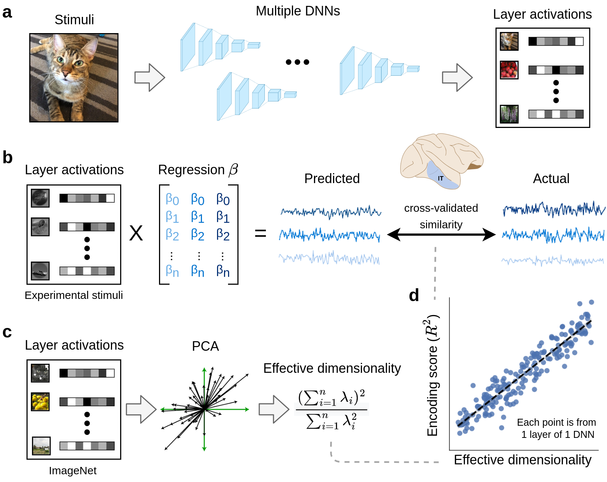
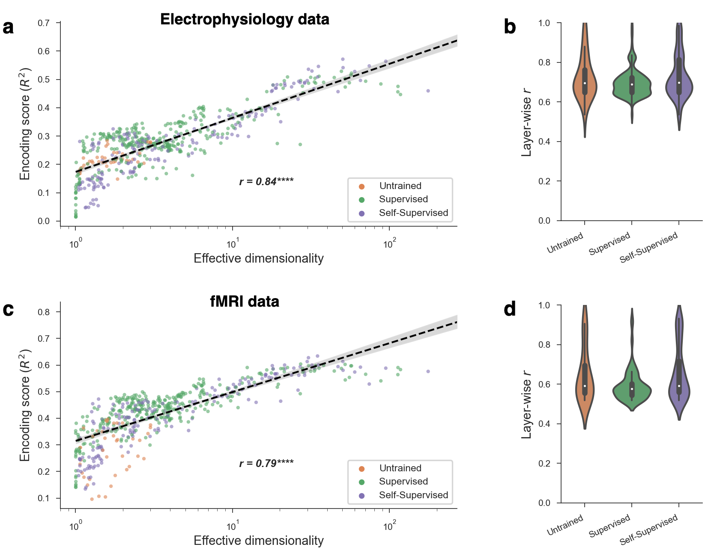

# Encoder Dimensionality

---

Code for a project investigating the effective dimensionality of deep neural networks, and its relationship to their ability to predict neural activity in visual cortex. Described in the paper: [High-performing neural network models of visual cortex benefit from high latent dimensionality](https://www.biorxiv.org/content/10.1101/2022.07.13.499969v1)

### Contents
- [Project overview](#project-overview)
  - [Abstract](#abstract)
  - [Methods](#methods)
  - [Main result](#main-result)
- [Reproducing paper results](#reproducing-results-and-figures-in-the-main-manuscript)
  - [Required packages](#required-packages)
  - [Generating results files](#generating-results-files)
  - [Generating figures](#generating-figures)

# Project overview

---

### Abstract

Geometric descriptions of deep neural networks (DNNs) have the potential to uncover core principles of computational models in neuroscience, while abstracting over the details of model architectures and training paradigms. Here we examined the geometry of DNN models of visual cortex by quantifying the latent dimensionality of their natural image representations. The prevailing view holds that optimal DNNs compress their representations onto low-dimensional manifolds to achieve invariance and robustness, which suggests that better models of visual cortex should have low-dimensional geometries. Surprisingly, we found a strong trend in the opposite direction—neural networks with high-dimensional image manifolds tend to have better generalization performance when predicting cortical responses to held-out stimuli in both monkey electrophysiology and human fMRI data. These findings held across a diversity of design parameters for DNNs, and they suggest a general principle whereby high-dimensional geometry confers a striking benefit to DNN models of visual cortex.

### Methods



**Method for comparing latent dimensionality with encoding performance for neural data.** **a.** Layer activations were extracted from a large bank of DNNs trained with different tasks, datasets, and architectures. **b.** Using these layer activations as input, we fit linear encoding models to predict neural activity elicited by the same stimuli in both monkey and human visual cortex. We used cross-validation to evaluate encoding performance on unseen stimuli. \textbf{c.} To estimate the effective dimensionality of our models, we ran principal component analysis on layer activations obtained from a large dataset of naturalistic stimuli (specifically, 10,000 images from the ImageNet validation set). \textbf{d.} These analyses allowed us to examine the empirical relationship between effective dimensionality and linear encoding performance across a diverse set of DNNs and layers. DNN = deep neural network, PCA = principal component analysis.

### Main result



**Relationship between effective dimensionality and encoding performance.** **a.** The encoding performance achieved by a model scaled with its effective dimensionality (Pearson $r = 0.59$, $p < 0.0001$). Each point in the plot was obtained from one layer from one DNN, resulting in a total of 536 models. **b.** Even when conditioning on a particular DNN layer, controlling for both depth and ambient dimensionality (i.e., number of neurons), effective dimensionality and encoding performance continued to strongly correlate. The plot shows the distribution of these correlations (Pearson $r$) across all unique layers in our analyses. **c,d.** The above trends also held \textit{within} different kinds of model training paradigms (supervised, self-supervised, untrained), further demonstrating the generality of the relationship between ED and encoding performance.

# Reproducing results and figures in the main manuscript

---

### Required packages

The code has been tested on Python 3.7.x with the following packages:
- `brain-score` [package link](https://github.com/brain-score/brain-score)
- `model-tools` [package link](https://github.com/brain-score/model-tools)
- `candidate-models` [package link](https://github.com/brain-score/candidate_models)
- `jupyter-lab` (for the figure generation)

The above is not an exaustive list. There are number of additional required packages (e.g. `pytorch`, `tensorflow`, `xarray`), which should be installed automatically as dependencies of those in the above list if you're using `pip`. After that, just try running the scripts following the commands below and install any remaining packages that Python complains are missing.

### Generating results files

To reproduce the results in the main manuscript, the following scripts must be run from the root project directory with the indicated command line arguments.

To compute the effective dimensionalities of all models:
```
python -m scripts.compute_eigenspectra --dataset imagenet
```

To compute the encoding performance of all models:
```
python -m scripts.fit_encoding_models --no_pooling
```

To compute transfer classification performance on ImageNet-21k (please reach out to me to receive the dataset):
```
python -m scripts.compute_nshot --dataset imagenet21k --data_dir [directory to imagenet21k dataset] --classifier prototype
```

To compute model projection distances on ImageNet-21k (please reach out to me to receive the dataset):
```
python -m scripts.compute_projection_distances --dataset imagenet21k --data_dir [directory to imagenet21k dataset]
```

Each of these scripts will generate one or more `*.csv` file in the `results/` directory.

### Generating figures

To reproduce the figures in the main manuscript, run the jupyter notebooks in the `figures/manuscript/` directory. These read from the generated `*.csv` result files. 

Some code blocks generate figures from the Appendix and will rely on results files not created in the previous section (e.g. ZCA-transformed feature results). To generate those Appendix figures as well, run the other relevant scripts in the `scripts/` directory (scroll down to the bottom of the files to see the required arguments). Don't hesitate to reach out to me if you run into issues during this process.
